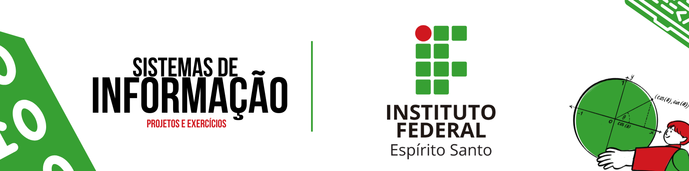

 
<h1 align="center"> 🕶 IFES Projects </h1>

   
  

---

## 📝 Descrição do Projeto

Este repositório contém os trabalhos e atividades do Segundo Periodo para as disciplinas do curso de Sistemas de Informação. O objetivo é aplicar os conceitos teóricos aprendidos em aula para a resolução de problemas práticos.

---

## 📚 Conteúdo

* Lista de Exercicios da Matéria de Programação 2
* Lista de Exercicios da Matéria de Matemática Discreta
* Trabalhos de Demais Matérias

---

***Gerador de Pastas e Arquivo em Python***

---

## 👨‍💻 Autor

* **Diogo Teodoro Dias Lamas**
* **GitHub:** [TheTekig](https://github.com/TheTekig)
